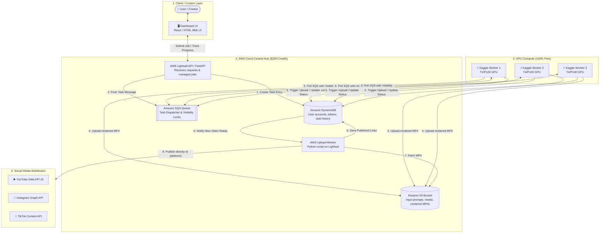

# 🏎️ PROJECT FERRARI: AWS-Powered Distributed AI Video Production & Publishing Architecture

> **Codename:** FERRARI (AWS Edition)  
> **Infrastructure:** AWS Cloud ($200 Student/Credit Plan) + 3 Free Kaggle GPU Workers  
> **Key Innovation:** Free Kaggle GPU Rendering + AWS SQS/S3/DynamoDB Orchestration + Automated AWS Cloud Social Media Publishing.

---

## 1. Executive Summary & The 6 AWS Master Jobs

Your AWS Master Server (running 24/7 on your $200 credits) handles the complete **6-step automated video empire**:

1. **Dashboard & Auth (`web_app/app.py`):** Collects user logins, manages multi-account persona profiles, and monitors campaigns.
2. **Trigger Workers (`/api/cluster/register`):** Autonomous coordinator that assigns render tasks to 3 free Kaggle T4 GPU nodes.
3. **Retrieve Rendered MP4s:** Downloads finished 9:16 videos with burned captions and split-screens from Kaggle.
4. **Stealth Multi-Platform Upload (`clipper/uploader/browser_engine.py`):** Uploads to YouTube, TikTok, and Instagram using Playwright with saved cookies and the Residential IP Tunnel guard.
5. **Monitor Live Views (`clipper/core/viral_detector.py`):** Automatically tracks view counts across all posted clips every hour.
6. **Instant Telegram Alerts (`clipper/core/telegram_notifier.py`):** Sends rich HTML notifications to your phone whenever a video hits viral criteria (e.g. ≥1,000 views) with calculated Whop payouts.

$$\text{Monthly Burn Rate} \approx \mathbf{\$5.50 \text{ – } \$6.00 / \text{month}} \implies \mathbf{\$200 \text{ lasts 30+ months (exceeds the 12-month credit validity!)}}$$

---

## 2. End-to-End System Architecture



---

## 3. Component Breakdown

### 1. Amazon SQS (Task Queue & Anti-Collision)
* **Visibility Timeout (900s):** When Kaggle Worker 1 picks up a job, SQS hides it from Worker 2 and Worker 3 for 15 minutes.
* **Dead-Letter Queue (DLQ):** If a worker crashes or Kaggle resets, the job automatically returns to the queue for another worker to process.

### 2. Amazon S3 (Buffer Storage)
* Kaggle workers upload completed `.mp4` video files to an S3 bucket (`s3://ferrari-video-buffer/ready/`).
* **Lifecycle Rule:** An S3 lifecycle policy automatically deletes videos 24 hours after publishing to keep storage usage virtually free.

### 3. Amazon DynamoDB (Database & User Auth)
* Stores user profiles, hashed passwords, task states (`QUEUED`, `PROCESSING`, `READY_FOR_UPLOAD`, `PUBLISHED`), and OAuth refresh tokens for YouTube, Instagram, and TikTok.

### 4. AWS Lightsail (The 24/7 Engine)
* **Specifications:** 1 vCPU, 1 GB RAM, 40 GB SSD, 1 TB free outbound data transfer bundle ($5/month).
* Runs two lightweight services:
  1. **Web API:** Serves the frontend Dashboard and accepts new generation requests.
  2. **Upload Daemon:** Listens for completed videos in S3, attaches user tokens, and uploads to YouTube, Instagram, and TikTok APIs.

---

## 4. Implementation Code

### 4.1 Kaggle Worker Daemon (`kaggle_worker.py`)
Run this in each of your 3 Kaggle notebooks. Uses `boto3` (the official AWS SDK):

```python
import time
import json
import boto3

# AWS Credentials (configured via Kaggle Secrets)
AWS_REGION = "us-east-1"
SQS_QUEUE_URL = "https://sqs.us-east-1.amazonaws.com/123456789012/ferrari-tasks"
S3_BUCKET_NAME = "ferrari-video-buffer"

sqs = boto3.client("sqs", region_name=AWS_REGION)
s3 = boto3.client("s3", region_name=AWS_REGION)
dynamodb = boto3.resource("dynamodb", region_name=AWS_REGION)
tasks_table = dynamodb.Table("ferrari_tasks")

WORKER_ID = "kaggle-gpu-worker-1"
print(f"[{WORKER_ID}] Online and polling AWS SQS...")

while True:
    # 1. Long-poll SQS for jobs (hides message for 15 mins)
    response = sqs.receive_message(
        QueueUrl=SQS_QUEUE_URL,
        MaxNumberOfMessages=1,
        WaitTimeSeconds=10,
        VisibilityTimeout=900
    )
    
    messages = response.get("Messages", [])
    if not messages:
        continue
        
    msg = messages[0]
    receipt_handle = msg["ReceiptHandle"]
    task_data = json.loads(msg["Body"])
    task_id = task_data["task_id"]
    
    print(f"[{WORKER_ID}] Claimed task: {task_id}")
    
    # 2. Update status in DynamoDB
    tasks_table.update_item(
        Key={"task_id": task_id},
        UpdateExpression="SET #s = :status, worker_id = :worker",
        ExpressionAttributeNames={"#s": "status"},
        ExpressionAttributeValues={":status": "PROCESSING", ":worker": WORKER_ID}
    )
    
    try:
        # 3. RUN GPU RENDERING (Veo / Dreamina / SD)
        output_mp4 = f"/kaggle/working/{task_id}.mp4"
        # render_video(task_data, output_path=output_mp4)
        
        # 4. Upload finished MP4 to S3
        s3_key = f"rendered/{task_id}.mp4"
        s3.upload_file(output_mp4, S3_BUCKET_NAME, s3_key)
        
        # 5. Delete message from SQS (task accomplished)
        sqs.delete_message(QueueUrl=SQS_QUEUE_URL, ReceiptHandle=receipt_handle)
        
        # 6. Notify DynamoDB that video is ready for AWS Uploader
        tasks_table.update_item(
            Key={"task_id": task_id},
            UpdateExpression="SET #s = :status, s3_key = :key",
            ExpressionAttributeNames={"#s": "status"},
            ExpressionAttributeValues={":status": "READY_FOR_UPLOAD", ":key": s3_key}
        )
        print(f"[{WORKER_ID}] Video rendered and uploaded to S3: {s3_key}")
        
    except Exception as e:
        print(f"[{WORKER_ID}] Error: {e}")
```

---

### 4.2 AWS Uploader Worker (`aws_uploader.py`)
Runs as a background daemon on AWS Lightsail:

```python
import time
import boto3
import requests
from googleapiclient.discovery import build
from googleapiclient.http import MediaFileUpload
from google.oauth2.credentials import Credentials

AWS_REGION = "us-east-1"
S3_BUCKET_NAME = "ferrari-video-buffer"

s3 = boto3.client("s3", region_name=AWS_REGION)
dynamodb = boto3.resource("dynamodb", region_name=AWS_REGION)
tasks_table = dynamodb.Table("ferrari_tasks")

def upload_to_youtube(video_path, title, desc, oauth_tokens):
    creds = Credentials(
        token=oauth_tokens["access_token"],
        refresh_token=oauth_tokens.get("refresh_token"),
        token_uri="https://oauth2.googleapis.com/token",
        client_id=oauth_tokens["client_id"],
        client_secret=oauth_tokens["client_secret"]
    )
    youtube = build("youtube", "v3", credentials=creds)
    body = {
        "snippet": {"title": title, "description": desc, "categoryId": "28"},
        "status": {"privacyStatus": "public"}
    }
    media = MediaFileUpload(video_path, chunksize=-1, resumable=True, mimetype="video/mp4")
    request = youtube.videos().insert(part="snippet,status", body=body, media_body=media)
    res = request.execute()
    return f"https://youtu.be/{res['id']}"

def upload_to_instagram_reels(video_s3_url, caption, ig_user_id, access_token):
    # Step 1: Create Container
    url = f"https://graph.facebook.com/v19.0/{ig_user_id}/media"
    res = requests.post(url, data={
        "media_type": "REELS",
        "video_url": video_s3_url,
        "caption": caption,
        "access_token": access_token
    }).json()
    container_id = res["id"]
    
    # Wait for processing
    time.sleep(15)
    
    # Step 2: Publish
    pub_url = f"https://graph.facebook.com/v19.0/{ig_user_id}/media_publish"
    pub_res = requests.post(pub_url, data={
        "creation_id": container_id,
        "access_token": access_token
    }).json()
    return pub_res

print("[AWS Uploader] Monitoring DynamoDB for READY_FOR_UPLOAD tasks...")

while True:
    # Query tasks ready for distribution
    response = tasks_table.scan(
        FilterExpression="#s = :status",
        ExpressionAttributeNames={"#s": "status"},
        ExpressionAttributeValues={":status": "READY_FOR_UPLOAD"}
    )
    
    for item in response.get("Items", []):
        task_id = item["task_id"]
        s3_key = item["s3_key"]
        local_file = f"/tmp/{task_id}.mp4"
        
        print(f"[AWS Uploader] Processing upload for task: {task_id}")
        
        # 1. Download MP4 from S3
        s3.download_file(S3_BUCKET_NAME, s3_key, local_file)
        
        # 2. Upload to YouTube
        yt_url = upload_to_youtube(
            local_file, 
            item["title"], 
            item["description"], 
            item["youtube_tokens"]
        )
        
        # 3. Mark as published in DynamoDB
        tasks_table.update_item(
            Key={"task_id": task_id},
            UpdateExpression="SET #s = :status, youtube_url = :yt",
            ExpressionAttributeNames={"#s": "status"},
            ExpressionAttributeValues={":status": "PUBLISHED", ":yt": yt_url}
        )
        print(f"[AWS Uploader] Task {task_id} published successfully: {yt_url}")
        
    time.sleep(10)
```

---

## 5. AWS Budget Allocation ($200 Total)

| AWS Resource | Configuration / Tier | Monthly Cost | 12-Month Total |
| :--- | :--- | :--- | :--- |
| **AWS Lightsail** | 1 vCPU, 1 GB RAM, 40GB SSD, 1TB Transfer | **$5.00** | $60.00 |
| **Amazon SQS** | Standard Queue (Under 1M requests/mo) | **$0.00** *(Free Tier)* | $0.00 |
| **Amazon DynamoDB** | On-Demand (Under 25 GB storage) | **$0.00** *(Free Tier)* | $0.00 |
| **Amazon S3** | 10–20 GB temporary buffer with 24h lifecycle | **$0.50** | $6.00 |
| **Data Transfer Out** | 100 GB Free Tier + 1 TB Lightsail bundle | **$0.00** | $0.00 |
| **TOTAL** | | **~$5.50 / month** | **~$66.00 / year** |

> **Surplus:** After 1 full year, you will still have **~$134 in unspent credits**!

---

## 6. Migration Checklist from Azure to AWS

- [x] Replace `Azure Storage Queue` with **Amazon SQS** (`boto3.client('sqs')`).
- [x] Replace `Azure Blob Storage` with **Amazon S3** (`boto3.client('s3')`).
- [x] Replace `Azure SQL / CosmosDB` with **Amazon DynamoDB** (`boto3.resource('dynamodb')`).
- [x] Replace `Azure App Service` with **AWS Lightsail $5 instance** (FastAPI backend + Uploader script).
- [x] Keep heavy GPU video generation on **3 Kaggle workers** ($0 compute cost).
