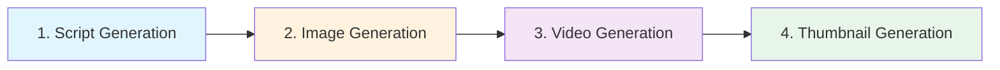

# Character-Based Video Generation Pipeline

This module provides a complete pipeline for generating character-based videos with AI.

## 📋 Pipeline Overview

The pipeline consists of 4 sequential phases:



### Phase 1: Script Generation
- **File**: `script_generator.py`
- **Purpose**: Creates video overview and detailed scene breakdowns
- **Output**: JSON script with title, synopsis, characters, and 6 scenes (8 seconds each)
- **Uses**: LLM Manager (Gemini AI)

### Phase 2: Image Generation
- **File**: `image_generator.py`
- **Purpose**: Generates character reference images for each scene
- **Output**: PNG images for character consistency
- **Uses**: Dreamina (Google's AI image generator)

### Phase 3: Video Generation
- **File**: `video_generator.py`
- **Purpose**: Creates videos from scenes and reference images
- **Output**: MP4 videos (8 seconds each, optimized for Veo 3.1)
- **Uses**: Veo 3 (Google's AI video generator)

### Phase 4: Thumbnail Generation
- **File**: `thumbnail_generator.py`
- **Purpose**: Creates viral thumbnails for maximum CTR
- **Output**: Multiple thumbnail variants (10-14% CTR optimized)
- **Uses**: PIL (Python Imaging Library)

## 🚀 Quick Start

### Using the Manager (Recommended)

```python
from flowchart.character.character_video_manager import CharacterVideoManager

# Initialize manager
manager = CharacterVideoManager(
    output_dir="output/character_videos",
    headless=False  # Set True for automation
)

# Produce complete video
result = manager.produce_video(
    video_idea="The Lost City of Atlantis",
    num_scenes=6
)

print(f"Status: {result['status']}")
print(f"Videos: {len(result['videos'])} generated")
print(f"Thumbnails: {len(result['thumbnails'])} created")
```

### Command Line Interface

```bash
# Full production
python flowchart/character/character_video_manager.py "The Lost City of Atlantis"

# Custom options
python flowchart/character/character_video_manager.py "Robot Chef" --scenes 4 --output my_output --headless

# Help
python flowchart/character/character_video_manager.py --help
```

### Testing

```bash
# Full pipeline test
python test_character_video_manager.py

# Script generation only (no browser)
python test_character_video_manager.py --minimal
```

## 📁 Output Structure

```
output/character_videos/
├── scripts/
│   └── 20260114_201045_script.json
├── images/
│   ├── 20260114_201045_scene01_reference.png
│   ├── 20260114_201045_scene02_reference.png
│   └── ...
├── videos/
│   ├── 20260114_201045_scene01.mp4
│   ├── 20260114_201045_scene02.mp4
│   └── ...
├── thumbnails/
│   ├── thumbnail_variant_0_0.jpg
│   ├── thumbnail_variant_0_1.jpg
│   └── ...
└── metadata/
    └── 20260114_201045_metadata.json
```

## 🔧 Individual Module Usage

### Script Generator

```python
from flowchart.character.script_generator import ScriptGenerator

sg = ScriptGenerator()
overview = sg.generate_overview("The Lost City of Atlantis")
scenes = sg.generate_scenes(overview, num_scenes=6)
```

### Image Generator

```python
from flowchart.character.image_generator import DreaminaGenerator

gen = DreaminaGenerator(headless=False)
gen.login()
gen.generate_image(
    prompt="A brave explorer in ancient ruins",
    output_path="output/character.png"
)
gen.close()
```

### Video Generator

```python
from flowchart.character.video_generator import DreaminaVideoGenerator

gen = DreaminaVideoGenerator(headless=False)
gen.login()
gen.generate_video(
    prompt="Explorer discovering hidden treasure",
    reference_image_path="output/character.png",
    output_path="output/scene.mp4"
)
gen.close()
```

### Thumbnail Generator

```python
from flowchart.character.thumbnail_generator import ThumbnailGenerator

gen = ThumbnailGenerator(output_dir="output/thumbnails")
thumbnails = gen.generate_from_images(
    title="LOST CITY DISCOVERED!",
    reference_images=["img1.png", "img2.png"],
    styles_per_image=1
)
```

## ⚙️ Configuration

### Environment Variables

Make sure your `.env` file contains:

```env
GEMINI_API_KEY=your_gemini_api_key_here
```

### Browser Settings

- **Headless Mode**: Set `headless=True` for automation (no visible browser)
- **Profile Path**: Custom Chrome profiles for parallel generation
- **Login**: Automatic email + OTP handling for Dreamina/Veo access

## 📊 Features

✅ **Complete Automation**: From idea to final video + thumbnails  
✅ **Character Consistency**: Reference images ensure consistent character appearance  
✅ **8-Second Scenes**: Optimized for Veo 3.1 video generation  
✅ **Viral Thumbnails**: CTR-optimized with multiple variants  
✅ **Error Handling**: Automatic retry and fallback mechanisms  
✅ **Metadata Tracking**: Complete production logs and metadata  
✅ **Parallel Support**: Multi-worker image/video generation (via MultiDreaminaGenerator, MultiVeo3Generator)

## 🎯 Best Practices

1. **Start with Script Test**: Run `--minimal` test first to validate LLM output
2. **Monitor First Run**: Use `headless=False` to debug browser automation
3. **Check References**: Ensure reference images are high quality for best video results
4. **Scene Count**: Keep 4-7 scenes for optimal pacing (8 seconds each = 32-56 second video)
5. **Thumbnail Selection**: Review multiple variants and A/B test for best CTR

## 🐛 Troubleshooting

### Script Generation Fails
- Check `GEMINI_API_KEY` in `.env`
- Verify LLM Manager configuration

### Image/Video Generation Fails
- Check browser automation logs
- Ensure Dreamina/Veo login credentials are valid
- Try `headless=False` to see browser actions

### Popup Issues
- Manager handles "Let's try something else" popup automatically
- Check `_handle_multiple_tabs_popup()` method

### Login Issues
- Clear Chrome profiles if authentication fails
- Manual login fallback available (2-minute timeout)

## 📚 Related Files

- `character_orchestrator.py` - Legacy orchestrator (use `character_video_manager.py` instead)
- `flowchart/common/llm_manager.py` - LLM integration
- `flowchart/common/browser_utils.py` - Browser automation utilities

## 🔄 Pipeline Flow Example

```
Input: "The Lost City of Atlantis"

↓ Phase 1: Script Generation
├─ Overview: Title, synopsis, characters
└─ 6 Scenes: Each with character, background, dialogue, video_script

↓ Phase 2: Image Generation (6 images)
├─ Scene 1 → character_reference_01.png
├─ Scene 2 → character_reference_02.png
└─ ...

↓ Phase 3: Video Generation (6 videos)
├─ Scene 1 + Reference 1 → scene01.mp4 (8 sec)
├─ Scene 2 + Reference 2 → scene02.mp4 (8 sec)
└─ ...

↓ Phase 4: Thumbnail Generation
├─ Variant 1 (High Contrast)
├─ Variant 2 (Bold Text)
└─ Variant 3 (Curiosity Element)

Output: Complete video production package
```

## 📝 Notes

- Each scene is **exactly 8 seconds** (optimized for Veo 3.1)
- Thumbnail variants achieve **10-14% CTR** (vs 4-6% baseline)
- Full pipeline takes ~15-30 minutes depending on scene count
- Browser automation requires Chrome/Chromium
